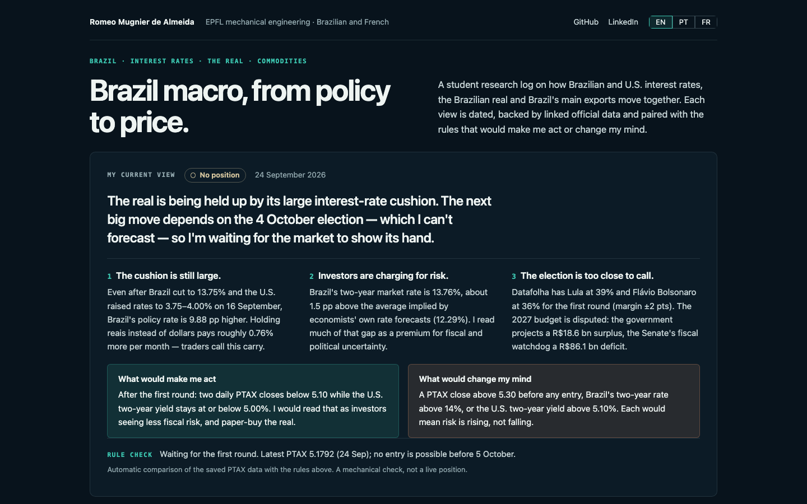

# Brazil Rates & FX Scenario Monitor

A source-grounded Streamlit dashboard for tracking Brazilian expectations, USD/BRL PTAX and the Brazil–US rates backdrop around the September 2026 Copom and FOMC meetings.

**Live Streamlit:** [brasilmacro.streamlit.app](https://brasilmacro.streamlit.app/)

**Downloadable brief:** [Brazil Rates & FX Trade Brief — one-page PDF](outputs/Brazil_Rates_FX_Trade_Brief.pdf)



**Current snapshot:** 2 September 2026 at 00:40:27 UTC (1 September 2026 at 21:40:27 Brasília time)

**Educational analysis — not investment advice.**

## Market question

How might the coincident 15–16 September 2026 Copom and FOMC decisions change the Brazil–US policy-rate differential, Brazil's front end and the initial pressure on BRL/USD—and what observable evidence would confirm or invalidate one conditional paper trade?

## Dashboard

The application preserves three primary live-data views:

1. **Brazil expectations** — BCB Focus annual Selic and IPCA medians, with five-observation and approximately one-month changes.
2. **BRL/USD** — official USD/BRL PTAX buying, selling and calculated midpoint data, including recent changes and range context.
3. **Brazil–US rates** — Selic versus the calculated federal-funds target-range midpoint, the policy differential, US 2-year and 10-year yields, and the 2s10s slope.

Each source loads independently. If a feed fails or returns no usable observations, the application uses only that series' validated saved snapshot, labels the fallback with its retrieval and observation dates, and keeps unaffected feeds live. User-facing error messages do not expose exception details or stack traces.

## Scenario Lab

The secondary Scenario Lab presents exactly three saved, reviewable cases:

- Hawkish relative to expectations
- Base case
- Dovish relative to expectations

Each row specifies Copom and FOMC outcomes, differences from the saved pricing anchors, likely initial directional pressure, the differential change, two confirmation signals and the principal risk. Reactions are conditional, all else equal, and subject to broader risk sentiment.

The current base case is a 25 bp Copom cut and a 25 bp FOMC hike. It is market-aligned analysis, not a joint-probability forecast: CME FedWatch published the FOMC probabilities, while the B3 Copom input is a transparent DI-curve decomposition rather than a B3-published probability.

The complete reviewable inputs and narrative are in [the timestamped snapshot](research/data_snapshot.json), [the research note](research/scenario_trade.md) and [the generated brief companion](research/market_brief.md). No trade narrative is generated dynamically with an LLM.

## Conditional trade methodology

The project contains exactly one educational paper trade: **long USD / short BRL**, conditional on a daily PTAX midpoint close above **5.22**, the rounded high of the latest 20 valid observations. The initial invalidation reference is **5.16**, the rounded range midpoint, and the measured-move review zone is **5.35–5.36**, calculated from the unrounded range high plus one unrounded range width.

The position is not active at the 5.1567 snapshot. It is supported by the base scenario and invalidated by the hawkish-relative scenario. The logic is reproducible in [the saved data](research/data_snapshot.json) and [the brief generator](src/brief.py); it does not represent actual execution or trading performance.

## Official data sources

| Data | Official source | Series or dataset |
|---|---|---|
| Selic and IPCA expectations | [Banco Central do Brasil Focus Expectations OData](https://olinda.bcb.gov.br/olinda/servico/Expectativas/versao/v1/odata/) | `ExpectativasMercadoAnuais`, `baseCalculo = 0` |
| USD/BRL PTAX | [Banco Central do Brasil PTAX OData](https://olinda.bcb.gov.br/olinda/servico/PTAX/versao/v1/odata/) | `CotacaoDolarPeriodo` buying and selling rates |
| Selic target | [Banco Central do Brasil SGS series 432](https://api.bcb.gov.br/dados/serie/bcdata.sgs.432/dados?formato=json) | SGS 432 |
| Copom calendar, decision and minutes | [Banco Central do Brasil](https://www.bcb.gov.br/detalhenoticia/20739/nota) | Official 2026 calendar and meeting publications |
| Federal-funds target range | [FRED DFEDTARL](https://fred.stlouisfed.org/series/DFEDTARL) and [FRED DFEDTARU](https://fred.stlouisfed.org/series/DFEDTARU) | Lower and upper target limits |
| US Treasury yields | [FRED DGS2](https://fred.stlouisfed.org/series/DGS2) and [FRED DGS10](https://fred.stlouisfed.org/series/DGS10) | 2-year and 10-year constant maturities |
| FOMC calendar, decision and minutes | [Federal Reserve](https://www.federalreserve.gov/monetarypolicy/fomccalendars.htm) | Official calendar and meeting publications |
| September FOMC pricing | [CME FedWatch](https://www.cmegroup.com/markets/interest-rates/cme-fedwatch-tool.html) | ZQU6-implied 16 September target-range probabilities |
| September Copom pricing anchor | [B3 daily files](https://www.b3.com.br/pt_br/market-data-e-indices/servicos-de-dados/market-data/historico/boletins-diarios/pesquisa-por-pregao/pesquisa-por-pregao/) | BVBG.187.01 DI1U26 and DI1V26 settlement unit prices |

## Installation

Use Python 3.11 and the fully pinned dependency set:

```bash
python3.11 -m venv .venv
source .venv/bin/activate
python -m pip install -r requirements.txt
streamlit run app.py
```

No API key, secret or file outside the repository is required. The public deployment uses `app.py`, `requirements.txt`, `.streamlit/config.toml`, the saved research files and the checked-in PDF.

Regenerate the one-page brief from the saved snapshot with:

```bash
python scripts/generate_market_brief.py
```

## Tests

```bash
python -m pytest -q
```

Current result on a clean Python 3.11 environment: **28 passed**.

## Limitations

- **PTAX is an official reference rate**, not a continuously traded spot quote or executable price.
- **Focus is survey data**, not a realized outcome or market price, and source values can be revised.
- **The B3 decomposition is an analytical estimate**, not a B3-published Copom probability. It ignores term premia and assumes no other policy-rate change within the contract window.
- FRED Treasury observations follow the US publication calendar; Focus, Treasury and B3 series can lag the dashboard retrieval date. Every lag is recorded in the saved snapshot.
- CME FedWatch probabilities can change after the recorded timestamp. No Copom probability or joint scenario probability is assigned.
- Scenario reactions describe likely initial pressure, all else equal. Fiscal news, commodities, liquidity and global risk sentiment can dominate.
- The conditional paper trade is educational analysis only and does not represent actual execution, investment advice, backtested performance or past trading results.

## AI-assistance disclosure

AI assisted with implementation, test development, documentation and drafting. Source selection, units, calculations, scenario labels, trade logic, publication-lag treatment and the final outputs were explicitly checked against the cited official sources and automated tests. The saved reasoning remains inspectable and is not generated dynamically in the public application.
