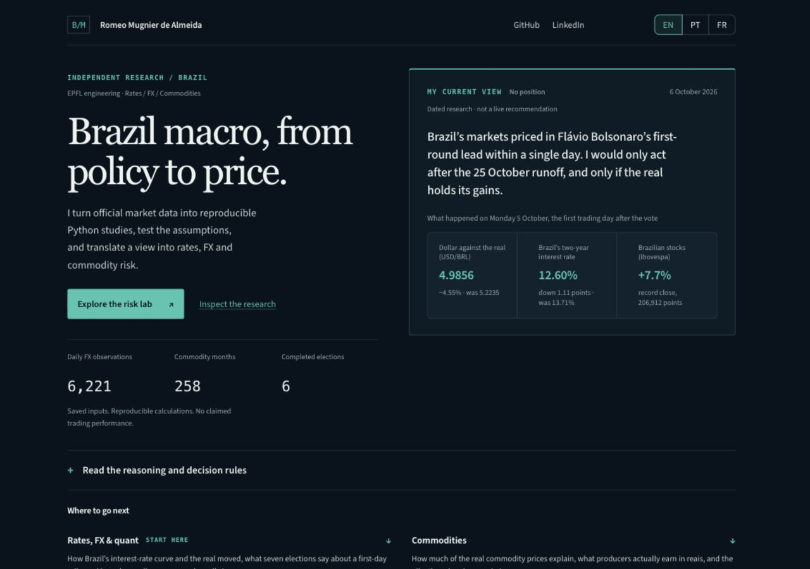

# Brazil Macro

A student research log on how Brazilian and U.S. interest rates, the Brazilian real and Brazil's main commodity exports move together. The compact homepage connects a dated market view with reproducible studies, an interactive risk lab and a check of model assumptions. Each view has explicit decision rules and is reviewed after the fact.

Public site: https://brasilmacro.streamlit.app/ (English, `?lang=pt` Português, `?lang=fr` Français). Two shareable lenses remain available: [rates, FX and quant in English](https://brasilmacro.streamlit.app/?lens=quant&lang=en) (the default), [commodities in English](https://brasilmacro.streamlit.app/?lens=commodities&lang=en) and [commodities in Portuguese](https://brasilmacro.streamlit.app/?lens=commodities&lang=pt). The commodity lens also opens the producer scenario first.

Educational research, not investment advice. No real positions and no claimed performance.



## Current thesis (6 October 2026)

**The market paid for Flávio Bolsonaro's first-round lead in one session: on 5 October USD/BRL fell 4.55% and the two-year zero rate fell 111 bp. I stay out until 25 October, because my entry rule has become a test of whether that payment is kept.**

- The first trading day after the vote was the largest first-day reaction of the seven elections since 2002 (8.1 daily standard deviations, the 8th-largest one-day gain of the real in the data). The curve repriced sharply: about 61% of the additive two-year inflation/real-yield decomposition is lower breakeven inflation, which includes inflation-risk and liquidity premia. The gap to the economists' rate path went from +1.46 pp to +0.35 pp; this gap mixes expectations and premia. A "thesis review" checks the previous view against what happened.
- **Rules are unchanged on purpose** (entry below 5.10 from 26 October with the U.S. two-year yield at or below 5.00%; drop above 5.30; exit above 5.22; review 4.94–5.00 or 4 November): a rule changed after seeing the outcome is not a rule. In the units of the move, entry is "less than 48% of the 5 October rally reversed", so a trigger tells little; if it fires near today's level the position starts inside the review zone, and a trigger is a prompt to review.
- **Written for a first-time reader:** the homepage puts research scope and a compact dated view together, with direct links to the risk lab and saved research. The reasoning and decision rules expand on demand; sections lead with a takeaway and dense tables sit behind "Show the numbers".
- **Rates, FX and quant:** the ANBIMA zero curve before and after the first round (with the economists' path and the second-year forward), an event study across seven first rounds (among completed elections, only 2014, 2018 and 2022 exceeded twice prior volatility; this measures large price moves, not expectations surprises), jump-versus-diffusion volatility (realised, jump-robust, long-run), indicative policy-rate carry-to-volatility, and a single-close random-walk benchmark distinct from the full trade rule.
- **Commodities:** a six-commodity basket with fixed 2025 export weights (UN Comtrade), applied retrospectively, accounts for 28% of monthly USD/BRL return variance since 2005 (slope −0.40, with similar associations in both sample halves). This is descriptive, not causal or predictive; residual variance is not attributed to specific factors. The page also covers partial natural hedges (up to 10% for oil, none for iron ore, coffee, maize), twelve-month dollar versus real prices, the oil channel (EIA spot versus futures, Petrobras +8.2% against Brent −1.9% on 5 October), the sugar–ethanol–real switch and runoff read-throughs.

Market prices are from the close of 5 October. The full reasoning, the evidence sorted by type and the sources are on the site and in the printable briefs in `outputs/`. Earlier theses are preserved unchanged: `research/thesis_2026-10-05.json`, `research/thesis_2026-09-24.json` (with their saved inputs) and `research/data_snapshot.json` (13 September).

## Risk lab and model diagnostic (7 October 2026)

`src/lab.py` offers three offline scenarios with editable assumptions and a CSV download of inputs and results:

- **Rates:** a hypothetical zero-coupon bond, with dated ANBIMA yield defaults, exact repricing, DV01 and the duration approximation. Change maturity, face value, yield and a parallel rate shock.
- **FX:** compounded BRL investment growth relative to USD cash, adjusted for an FX shock. Policy rates are indicative funding proxies, not executable forward quotes.
- **Producer:** BRL export revenue under commodity and FX shocks, with an illustrative forward conversion rate and a hedge fraction of actual scenario receipts. A joint-shock matrix shows the combined revenue effect.

The separate risk study was published on **7 October** using observations frozen through **5 October**. It reconstructs one-session 99% VaR and model-implied expected shortfall for a fixed BRL spot holding marked in USD. Each historical forecast uses only observations available before its evaluation date. Models and the evaluation period were chosen at publication; these forecasts were **not published prospectively**, and the period was not an independently reserved test set.

All models share **2,700 evaluation dates**, 4 January 2016–5 October 2026. Against a nominal **1% breach rate** (27 expected breaches):

| Model | Breaches | Observed breach rate |
| --- | ---: | ---: |
| Normal, rolling 20 sessions | 63 | 2.33% |
| Normal, EWMA λ = 0.94 | 61 | 2.26% |
| Historical, rolling 250 sessions | 36 | 1.33% |

The Normal models understate the observed frequency of large BRL losses. Kupiec's test measures unconditional breach frequency; it does not establish independence, conditional coverage or ES calibration. Historical simulation is not rejected at a 5% level against the nominal target, but its finite-window quantile granularity and possible breach clustering limit that interpretation. This is model validation, not a strategy-performance claim.

Run `python scripts/build_risk.py` offline to reproduce [the risk summary](research/risk_2026-10-07.json) and [every forecast and outcome](research/risk_forecasts.csv). The CSV records training dates, VaR, ES and breach indicators for all three models. [The method note](research/risk_method.md) documents loss units, time order, formulas, coverage-test limitations and scenario arithmetic. Latest next-session predictions at the frozen cutoff are separate from evaluated forecasts and have no observed outcome in this dataset.

## How it works

```
GitHub Actions (weekdays, 22:17 UTC)                      Streamlit Community Cloud
scripts/refresh_market_data.py                            app.py
  ├─ BCB: PTAX, Selic (SGS 432), Focus survey               reads research/thesis.json      (dated thesis, numbers only)
  ├─ New York Fed → Fed target range  (FRED fallback)       reads research/study_*.json     (the quantitative study)
  ├─ ...                                                    reads research/risk_*.json      (frozen risk diagnostic)
  ├─ ...                                                    reads research/live_snapshot.json (refreshed data)
  ├─ U.S. Treasury → 2y/10y yields   (FRED fallback)        renders cached HTML per language; no network, no pandas
  └─ FRED: Brent (EIA), iron ore / soy / sugar (IMF)
        │ each source validated independently
        ▼
research/live_snapshot.json  ──commit──▶  redeploy  ──▶  page shows every value with its own date and freshness
scripts/check_freshness.py   ──▶ run fails (owner notified) if key figures are > 1 week old
```

- **Visitors never trigger a data request.** The page reads local thesis, study, risk and refreshed-data files plus pre-generated PDFs. HTML is cached per language, lens and data version; scenario changes run local calculations only.
- **One failed feed never blanks or freezes the others.** Each source keeps its last good value, original date and an error message in `refresh.sources`; the page flags delayed or stale values instead of hiding them.
- **Honest refresh claims.** The page states when the job last ran and how many sources updated. Until 24 September 2026 the job reported success while every FRED request timed out on GitHub's runners, and the all-or-nothing build also discarded valid BCB data; the page kept showing 13 September figures. Sources are now independent, U.S. data has official fallbacks, and staleness turns the run red.
- **The thesis is never rewritten by the updater.** Research prose lives in `src/content.py` (EN/PT/FR); thesis figures come from `research/thesis.json` and the quantitative study `research/study_2026-10-06.json`, built offline by `src/study.py` from frozen inputs (`research/thesis_snapshot_2026-10-06.json`, `research/study_inputs_2026-10-06.json`). The new risk diagnostic uses that same saved study input and is built separately by `scripts/build_risk.py`; it does not change the existing macro study or receive live updates. Homepage and lab copy lives in `src/lab_content.py`. The scheduled updater only refreshes market data; the page mechanically checks the pre-committed rules against new PTAX closes, including reversal of the first-Monday move.

## Run locally

Python 3.11 is the Community Cloud and CI target (3.9+ works).

```bash
python3.11 -m venv .venv
source .venv/bin/activate
python -m pip install -r requirements-dev.txt
python -m streamlit run app.py
```

Open http://localhost:8501 (add `?lang=pt` or `?lang=fr`).

```bash
python -m pytest -q                                   # mathematical, data, rendering and localization checks
python scripts/refresh_market_data.py                 # fetch official data (network)
python scripts/check_freshness.py                     # exit 1 if key data is stale
python scripts/collect_study_inputs.py               # fetch the study's raw inputs (network): PTAX since 2002, ANBIMA curves, IMF monthly prices, UN Comtrade
python scripts/build_study.py                         # recompute research/study_2026-10-06.json from those inputs (offline)
python scripts/build_risk.py                          # reproduce risk summary JSON and per-day audit CSV (offline)
python scripts/generate_market_brief.py               # regenerate the three PDFs + Markdown brief
```

Production installs only `requirements.txt` (Streamlit). The refresh job installs `requirements-refresh.txt` (pandas, requests); PDF generation and tests use `requirements-dev.txt`.

## Keeping the app awake

[Keep Streamlit Awake](.github/workflows/keep-streamlit-awake.yml) opens the public site in headless Chromium through Playwright at **00:23, 08:23 and 16:23 UTC every day**. The eight-hour cadence leaves a four-hour buffer against [Community Cloud's 12-hour inactivity window](https://docs.streamlit.io/deploy/streamlit-community-cloud/manage-your-app#app-hibernation). It clicks the wake-up button if needed, waits for the actual dashboard to render (including inside Streamlit's iframe), holds the browser session open for 15 seconds and retries one failed visit. No secrets or changes to the app's dependencies are needed.

The workflow also runs when its file is pushed to `main`, and can be started from **Actions → Keep Streamlit Awake → Run workflow**. It must be on the default branch for scheduled visits. A failed visit produces a failed Actions run; inspect that run's logs.

[Keep Repository Active](.github/workflows/keep-repository-active.yml) pushes an **empty commit to `main` on the first day of every month at 03:41 UTC** (at most 31 days between scheduled commits). This adds repository activity without changing any files, providing a backup if the market-data updater stops committing. It also runs when its workflow file changes on `main` and supports **Actions → Keep Repository Active → Run workflow**. It uses GitHub's built-in token with permission to write repository contents; no personal token or extra secret is needed. Token-generated pushes do not trigger further Actions runs, avoiding a commit loop.

This is best-effort availability: [GitHub can delay or drop scheduled runs and disables schedules in public repositories after 60 days without repository activity](https://docs.github.com/en/actions/reference/workflows-and-actions/events-that-trigger-workflows#schedule). If disabled, re-enable the workflow in Actions. The existing market-data refresh remains separate.

## Updating the thesis

1. Archive the old thesis (`cp research/thesis.json research/thesis_<its date>.json`), then save the data as of the new date: copy `research/live_snapshot.json` to `research/thesis_snapshot_<date>.json`. Collect the study's raw inputs (`scripts/collect_study_inputs.py`; ANBIMA keeps only the last few weeks of curves online, so collect them while they are available).
2. Write the new numbers, rules, review verdicts and sources in `research/thesis.json` (point `inputs_file` and `previous_file` at the right files; when markets have not yet reopened on the thesis date, set `data_as_of` to the last session so the rule monitor still checks the first close).
3. Edit the prose in `src/content.py` in all three languages — placeholders only, no literal figures.
4. `python scripts/build_study.py`, `python scripts/generate_market_brief.py`, then `python -m pytest -q`. The tests fail if a number cannot be reproduced from the saved inputs (the study tests recompute the headline figures by hand), a language is missing a string, or the committed PDFs are out of date. Keep the 7 October risk diagnostic frozen; a later risk publication should preserve this version, document its input cutoff and evaluation choices, and reproduce its JSON/CSV offline.

## Tests

Checks cover independent-source refresh and fallbacks, malformed feeds and outages, freshness thresholds, thesis consistency, rule monitoring, localization and PDF reproducibility. Macro-study tests independently recompute event moves, volatility, forwards, curve decomposition, commodity regression and rule geometry from saved inputs.

Risk tests independently verify the exact BRL loss convention, Normal tail integrals, fractional historical-tail weights, EWMA update order, breach counts and Kupiec boundary cases. Same-day/future mutations and truncated histories check that earlier forecasts cannot change. The committed summary and CSV must reproduce offline. Scenario tests check DV01 units, shock signs, exact FX conversion, mixed producer shocks, hedge limits, invalid inputs and all three languages without network access. Missing or partial risk data must not break the market research. Layout and browser checks cover desktop and mobile; PDF checks cover searchable content, localization and agreement with the dated thesis.

## Files

- `app.py` — production entrypoint (Streamlit shell, caching, language/lens switches, interactive scenarios and downloads).
- `src/page.py`, `src/chart.py`, `src/style.css` — HTML sections (two lenses, ordered by `?lens=`), five inline-SVG figures (PTAX with the decision levels, zero curves, event paths, commodity scatter, producer prices), the design system.
- `src/study.py` — the quantitative study (pure standard library): event study, volatility, curve, commodity basket, rule geometry.
- `src/risk.py` — retrospective risk-model evaluation and deterministic scenario arithmetic (pure standard library).
- `src/lab.py`, `src/lab_content.py` — interactive scenario controls, CSV exports, and localized homepage/lab copy.
- `src/content.py` — research copy in English, Portuguese and French.
- `src/thesis.py`, `src/formatting.py`, `src/freshness.py` — thesis loading, rule check, calculations, locale formatting, freshness rules.
- `src/live_refresh.py`, `src/data.py`, `src/analytics.py` — scheduled refresh, source parsers, calculations (refresh job only).
- `src/pdf_brief.py` — printable brief and Markdown companion (offline only).
- `research/thesis.json`, `research/thesis_snapshot_2026-10-06.json`, `research/live_snapshot.json` — dated thesis, its frozen inputs (refreshed data plus the election count, final polls, ANBIMA curves and the 2014/2018/2022 PTAX windows), refreshed data.
- `research/study_inputs_2026-10-06.json`, `research/study_2026-10-06.json` — the study's raw inputs (PTAX since 2002, ANBIMA curves, IMF monthly prices, UN Comtrade export values) and its computed results.
- `scripts/build_risk.py` — offline risk builder; `research/risk_2026-10-07.json` — frozen diagnostic summary; `research/risk_forecasts.csv` — complete per-model/date audit; `research/risk_method.md` — methodology and limitations.
- `research/thesis_2026-10-05.json`, `research/thesis_snapshot_2026-10-05.json`, `research/thesis_2026-09-24.json`, `research/thesis_snapshot_2026-09-24.json` — the previous theses and their inputs, preserved unchanged.
- `research/data_snapshot.json`, `research/commodity_snapshot.json`, `research/scenario_trade.md` — archived 13 September case.
- `outputs/` — the three PDFs. `tests/` — automated checks.

## Limits

PTAX is a daily reference rate, not an executable price. The paper-trade monitor checks conditions; it does not reconstruct fills, costs, carry, position sizing or realised strategy P&L, and no full trading strategy is back-tested. The lab lets visitors change face values, receipts and hedge fractions to explore exposure; these are hypothetical scenarios, not sizing recommendations or implemented trades. Its zero-coupon bond is not a DI future, policy rates are not executable funding quotes, and producer revenue conversion is not profit or a fixed-notional derivative payoff. Basis, collateral, production costs and execution costs are omitted.

The risk study is a retrospective reconstruction with lagged inputs, not prospectively published forecasts or an independently reserved test set. Kupiec assesses aggregate nominal breach frequency only; it does not validate independence, conditional coverage or expected shortfall. A non-rejection is not proof of calibration. Historical quantile granularity, serial dependence and regime changes matter. Latest predictions have no evaluated outcome in the frozen data.

ANBIMA's fitted zero curve is saved at 2 and 5 October; it is not live. Focus predates the vote, and the curve–survey gap mixes expectations and premia; breakeven inflation contains inflation-risk and liquidity premia. Press-reported 5 October figures (Ibovespa, DI futures, spot dollar, Brent, Petrobras) come from the live session. The contemporaneous commodity regression uses fixed 2025 weights retrospectively, covers 44% of exports and does not identify causes or forecast FX; IMF series end in July 2026. The random-walk benchmark has no drift and a hand-picked runoff-session shock; its percentages concern one close, not the full entry rule. No election probabilities are assigned, and only three completed first-round moves exceed 2σ. Community Cloud can still take a few seconds to wake a sleeping app.
