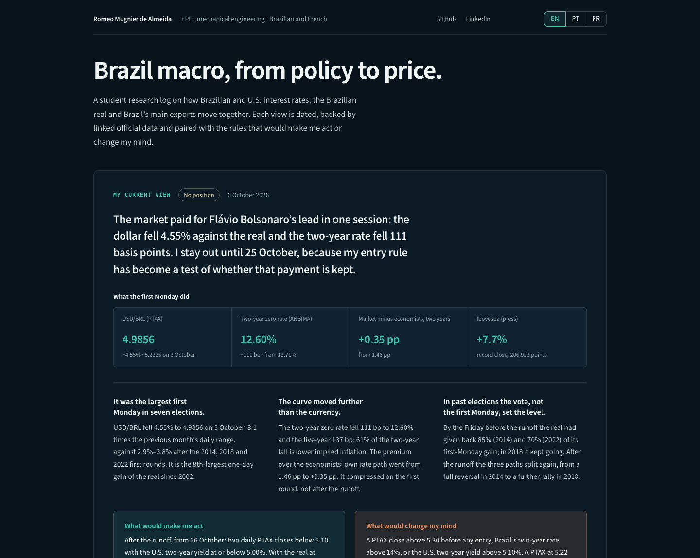

# Brazil Macro

A student research log on how Brazilian and U.S. interest rates, the Brazilian real and Brazil's main commodity exports move together. Each view is dated, backed by official data, and paired with the rules that would make me act or change my mind — and each old view is reviewed after the fact.

Public site: https://brasilmacro.streamlit.app/ (English, `?lang=pt` Português, `?lang=fr` Français). Two ways in, shareable by URL: `?lens=quant` (rates, FX and quant first, the default) and `?lens=commodities` (commodities first), e.g. `https://brasilmacro.streamlit.app/?lens=commodities&lang=pt`.

Educational research, not investment advice. No real positions and no claimed performance.



## Current thesis (6 October 2026)

**The market paid for Flávio Bolsonaro's first-round lead in one session: on 5 October USD/BRL fell 4.55% and the two-year zero rate fell 111 bp. I stay out until 25 October, because my entry rule has become a test of whether that payment is kept.**

- The first trading day after the vote was the largest first-day reaction of the seven elections since 2002 (8.1 daily standard deviations, the 8th-largest one-day gain of the real in the data), and the curve moved more than the currency: 61% of the two-year fall is lower implied inflation, and the gap to the economists' own rate path went from +1.46 pp to +0.35 pp. A short "track record" section checks the one-day-old first version of this view against what happened.
- **Rules are unchanged on purpose** (entry below 5.10 from 26 October with the U.S. two-year yield at or below 5.00%; drop above 5.30; exit above 5.22; review 4.94–5.00 or 4 November): a rule changed after seeing the outcome is not a rule. In the units of the move, entry is "less than 48% of the 5 October rally reversed", so a trigger tells little; if it fires near today's level the position starts inside the review zone, and a trigger is a prompt to review.
- **Written for a first-time reader:** the page opens with the view in plain language and three numbers, each section leads with a one-line takeaway, and the dense tables sit behind "Show the numbers".
- **Rates, FX and quant:** the ANBIMA zero curve before and after the first round (with the economists' path and the second-year forward), an event study across seven first rounds (only 2014, 2018 and 2022 were surprise-sized; the real's path after the runoff split from full reversal to further rally), jump-versus-diffusion volatility (realised, jump-robust, long-run), carry-to-volatility, and a random-walk benchmark for the rule.
- **Commodities:** a Brazil-weighted six-commodity basket (2025 export values, UN Comtrade) explains 28% of the variance of monthly USD/BRL changes since 2005 (slope −0.40, stable across halves of the sample); the real is only a partial natural hedge for producers (up to 10% for oil, none for iron ore, coffee, maize); twelve-month changes in dollars versus reais; the oil channel (EIA's spot-versus-futures gap, Petrobras +8.2% against Brent −1.9% on 5 October); the sugar–ethanol–real switch; and a runoff read-through by commodity.

Market prices are from the close of 5 October. The full reasoning, the evidence sorted by type and the sources are on the site and in the printable briefs in `outputs/`. Earlier theses are preserved unchanged: `research/thesis_2026-10-05.json`, `research/thesis_2026-09-24.json` (with their saved inputs) and `research/data_snapshot.json` (13 September).

## How it works

```
GitHub Actions (weekdays, 22:17 UTC)                      Streamlit Community Cloud
scripts/refresh_market_data.py                            app.py
  ├─ BCB: PTAX, Selic (SGS 432), Focus survey               reads research/thesis.json      (dated thesis, numbers only)
  ├─ New York Fed → Fed target range  (FRED fallback)       reads research/study_*.json     (the quantitative study)
  ├─ ...                                                    reads research/live_snapshot.json (refreshed data)
  ├─ U.S. Treasury → 2y/10y yields   (FRED fallback)        renders cached HTML per language; no network, no pandas
  └─ FRED: Brent (EIA), iron ore / soy / sugar (IMF)
        │ each source validated independently
        ▼
research/live_snapshot.json  ──commit──▶  redeploy  ──▶  page shows every value with its own date and freshness
scripts/check_freshness.py   ──▶ run fails (owner notified) if key figures are > 1 week old
```

- **Visitors never trigger a data request.** The page reads two small JSON files and pre-generated PDFs. HTML is built once per language and data version and cached in memory.
- **One failed feed never blanks or freezes the others.** Each source keeps its last good value, original date and an error message in `refresh.sources`; the page flags delayed or stale values instead of hiding them.
- **Honest refresh claims.** The page states when the job last ran and how many sources updated. Until 24 September 2026 the job reported success while every FRED request timed out on GitHub's runners, and the all-or-nothing build also discarded valid BCB data; the page kept showing 13 September figures. Sources are now independent, U.S. data has official fallbacks, and staleness turns the run red.
- **The thesis is never rewritten by the updater.** Prose lives in `src/content.py` (EN/PT/FR); every number comes from `research/thesis.json` and the quantitative study `research/study_2026-10-06.json`, built offline by `src/study.py` from the frozen inputs (`research/thesis_snapshot_2026-10-06.json`, `research/study_inputs_2026-10-06.json`), so tests can recompute each figure. The only automatic elements are a mechanical check of the pre-committed rules against new PTAX closes (including how much of the first-Monday move has been given back) and the refreshed tape.

## Run locally

Python 3.11 is the Community Cloud and CI target (3.9+ works).

```bash
python3.11 -m venv .venv
source .venv/bin/activate
python -m pip install -r requirements-dev.txt
python -m streamlit run app.py
```

Open http://localhost:8501 (add `?lang=pt` or `?lang=fr`).

```bash
python -m pytest -q                                   # 134 tests
python scripts/refresh_market_data.py                 # fetch official data (network)
python scripts/check_freshness.py                     # exit 1 if key data is stale
python scripts/collect_study_inputs.py               # fetch the study's raw inputs (network): PTAX since 2002, ANBIMA curves, IMF monthly prices, UN Comtrade
python scripts/build_study.py                         # recompute research/study_2026-10-06.json from those inputs (offline)
python scripts/generate_market_brief.py               # regenerate the three PDFs + Markdown brief
```

Production installs only `requirements.txt` (Streamlit). The refresh job installs `requirements-refresh.txt` (pandas, requests); PDF generation and tests use `requirements-dev.txt`.

## Keeping the app awake

[Keep Streamlit Awake](.github/workflows/keep-streamlit-awake.yml) opens the public site in headless Chromium through Playwright at **00:23, 08:23 and 16:23 UTC every day**. The eight-hour cadence leaves a four-hour buffer against [Community Cloud's 12-hour inactivity window](https://docs.streamlit.io/deploy/streamlit-community-cloud/manage-your-app#app-hibernation). It clicks the wake-up button if needed, waits for the actual dashboard to render (including inside Streamlit's iframe), holds the browser session open for 15 seconds and retries one failed visit. No secrets or changes to the app's dependencies are needed.

The workflow also runs when its file is pushed to `main`, and can be started from **Actions → Keep Streamlit Awake → Run workflow**. It must be on the default branch for scheduled visits. A failed visit produces a failed Actions run; inspect that run's logs.

[Keep Repository Active](.github/workflows/keep-repository-active.yml) pushes an **empty commit to `main` on the first day of every month at 03:41 UTC** (at most 31 days between scheduled commits). This adds repository activity without changing any files, providing a backup if the market-data updater stops committing. It also runs when its workflow file changes on `main` and supports **Actions → Keep Repository Active → Run workflow**. It uses GitHub's built-in token with permission to write repository contents; no personal token or extra secret is needed. Token-generated pushes do not trigger further Actions runs, avoiding a commit loop.

This is best-effort availability: [GitHub can delay or drop scheduled runs and disables schedules in public repositories after 60 days without repository activity](https://docs.github.com/en/actions/reference/workflows-and-actions/events-that-trigger-workflows#schedule). If disabled, re-enable the workflow in Actions. The existing market-data refresh remains separate.

## Updating the thesis

1. Archive the old thesis (`cp research/thesis.json research/thesis_<its date>.json`), then save the data as of the new date: copy `research/live_snapshot.json` to `research/thesis_snapshot_<date>.json`. Collect the study's raw inputs (`scripts/collect_study_inputs.py`; ANBIMA keeps only the last few weeks of curves online, so collect them while they are available).
2. Write the new numbers, rules, review verdicts and sources in `research/thesis.json` (point `inputs_file` and `previous_file` at the right files; when markets have not yet reopened on the thesis date, set `data_as_of` to the last session so the rule monitor still checks the first close).
3. Edit the prose in `src/content.py` in all three languages — placeholders only, no literal figures.
4. `python scripts/build_study.py`, `python scripts/generate_market_brief.py`, then `python -m pytest -q`. The tests fail if a number cannot be reproduced from the saved inputs (the study tests recompute the headline figures by hand), a language is missing a string, or the committed PDFs are out of date.

## Tests

Refresh behaviour (independent sources, fallbacks, malformed data, total outage), freshness thresholds and the CI gate, thesis consistency (every figure recomputed from saved inputs, including vote shares, runoff arithmetic, poll misses, the first-round event study and volatility bands; verdicts checked against the data), the quantitative study (first Mondays and givebacks, jump-versus-diffusion volatility, forwards and the inflation/real decomposition, the commodity regression and natural hedge, the rule's giveback geometry and random-walk benchmark, all recomputed independently of `src/study.py`), the rule monitor, EN/PT/FR structure and placeholder parity, French typography, "commodities" in Portuguese, page completeness and robustness to missing or malformed data, network isolation of the production render, PDF content/localization/searchability and that the committed PDFs match the current content, and static responsive-layout checks. Browser review covers 1440×900, 1280×720 and 375×812 in all three languages.

## Files

- `app.py` — production entrypoint (Streamlit shell, caching, language switch).
- `src/page.py`, `src/chart.py`, `src/style.css` — HTML sections (two lenses, ordered by `?lens=`), five inline-SVG figures (PTAX with the decision levels, zero curves, event paths, commodity scatter, producer prices), the design system.
- `src/study.py` — the quantitative study (pure standard library): event study, volatility, curve, commodity basket, rule geometry.
- `src/content.py` — every visible sentence in English, Portuguese and French.
- `src/thesis.py`, `src/formatting.py`, `src/freshness.py` — thesis loading, rule check, calculations, locale formatting, freshness rules.
- `src/live_refresh.py`, `src/data.py`, `src/analytics.py` — scheduled refresh, source parsers, calculations (refresh job only).
- `src/pdf_brief.py` — printable brief and Markdown companion (offline only).
- `research/thesis.json`, `research/thesis_snapshot_2026-10-06.json`, `research/live_snapshot.json` — dated thesis, its frozen inputs (refreshed data plus the election count, final polls, ANBIMA curves and the 2014/2018/2022 PTAX windows), refreshed data.
- `research/study_inputs_2026-10-06.json`, `research/study_2026-10-06.json` — the study's raw inputs (PTAX since 2002, ANBIMA curves, IMF monthly prices, UN Comtrade export values) and its computed results.
- `research/thesis_2026-10-05.json`, `research/thesis_snapshot_2026-10-05.json`, `research/thesis_2026-09-24.json`, `research/thesis_snapshot_2026-09-24.json` — the previous theses and their inputs, preserved unchanged.
- `research/data_snapshot.json`, `research/commodity_snapshot.json`, `research/scenario_trade.md` — archived 13 September case.
- `outputs/` — the three PDFs. `tests/` — automated checks.

## Limits

PTAX is the central bank's daily reference rate, not an executable price; costs, spreads and sizing are not modelled. ANBIMA's zero curve is a fitted model, saved at 2 and 5 October (ANBIMA keeps only recent weeks online). Focus is a survey and its latest edition predates the vote; the market-vs-economists gap mixes expectations and risk premium. The press-reported 5 October market figures (Ibovespa, DI futures, spot dollar, Brent, Petrobras) come from the live session. The commodity regression is descriptive and covers 44% of exports; the IMF series end in July 2026. The random-walk benchmark has no drift and a hand-picked runoff-day shock. No probabilities are assigned and no rule has been back-tested; the first-round study has three surprise-sized cases. Community Cloud can still take a few seconds to wake a sleeping app.

AI tools (OpenAI Codex/ChatGPT and Anthropic Claude) helped write the code, draft research text and translate. The question, the rules and the final judgement are mine; every figure links to its source.
